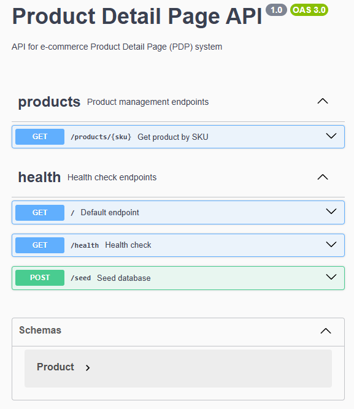

<p align="center">
  <a href="http://nestjs.com/" target="blank"></a>
</p>

[circleci-image]: https://img.shields.io/circleci/build/github/nestjs/nest/master?token=abc123def456
[circleci-url]: https://circleci.com/gh/nestjs/nest

  <p align="center">A progressive <a href="http://nodejs.org" target="_blank">Node.js</a> framework for building efficient and scalable server-side applications.</p>
    <p align="center">
<a href="https://www.npmjs.com/~nestjscore" target="_blank"></a>
<a href="https://www.npmjs.com/~nestjscore" target="_blank"></a>
<a href="https://www.npmjs.com/~nestjscore" target="_blank"></a>
<a href="https://circleci.com/gh/nestjs/nest" target="_blank"></a>
<a href="https://discord.gg/G7Qnnhy" target="_blank"></a>
<a href="https://opencollective.com/nest#backer" target="_blank"></a>
<a href="https://opencollective.com/nest#sponsor" target="_blank"></a>
  <a href="https://paypal.me/kamilmysliwiec" target="_blank"></a>
    <a href="https://opencollective.com/nest#sponsor"  target="_blank"></a>
  <a href="https://twitter.com/nestframework" target="_blank"></a>
</p>
  <!--[](https://opencollective.com/nest#backer)
  [](https://opencollective.com/nest#sponsor)-->

# PDP System - Backend API (NestJS) [](https://codecov.io/gh/deltemp/api-case-pdp)

API REST para sistema de Página de Detalhes do Produto (PDP) desenvolvida com NestJS, TypeORM e PostgreSQL/SQLite.

<hr/>

<center>



</center>

<hr/>

## 🚀 Tecnologias

- **NestJS** framework progressivo para Node.js
- **TypeORM** para mapeamento objeto-relacional
- **PostgreSQL** / **SQLite** suporte a múltiplos bancos
- **Swagger** documentação automática da API
- **Jest** framework de testes
- **TypeScript** tipagem estática

## Description

API robusta construída com [NestJS](https://github.com/nestjs/nest) framework TypeScript.

## 📁 Estrutura do Projeto

```
src/
├── api/                    # Módulos da API
│   └── products/          # Módulo de produtos
│       ├── controllers/   # Controllers REST
│       ├── entities/      # Entidades TypeORM
│       └── services/      # Lógica de negócio
├── database/              # Configuração do banco
│   ├── migrations/        # Migrações TypeORM
│   ├── database.provider.ts
│   └── database.constants.ts
├── filters/               # Filtros de exceção
│   └── http-exception.filter.ts
├── seeder/               # Populador de dados
│   └── seeder.service.ts
├── app.controller.ts     # Controller principal
├── app.module.ts         # Módulo raiz
└── main.ts              # Ponto de entrada
```

## 🛠️ Instalação e Execução

1. **Instalar dependências:**
```bash
npm install
```

2. **Configurar variáveis de ambiente:**
```bash
cp .env.example .env
# Configure as variáveis de banco de dados
```

3. **Compilar e executar:**
```bash
# desenvolvimento
npm run start

# modo watch (recarregamento automático)
npm run start:dev

# modo debug
npm run start:debug

# produção
npm run start:prod
```

4. **Executar testes:**
```bash
# testes unitários
npm run test

# testes em modo watch
npm run test:watch

# cobertura de testes
npm run test:cov

# testes com debug
npm run test:debug

# testes e2e
npm run test:e2e
```

5. **Análise e qualidade:**
```bash
npm run lint              # Verificar e corrigir qualidade do código
npm run format            # Formatar código com Prettier
npm run build             # Compilar TypeScript
```

## 🎯 Funcionalidades Implementadas

### 📦 API de Produtos
- **GET /products/:sku** - Buscar produto por SKU
- **Validação de parâmetros** com class-validator
- **Tratamento de erros** personalizado
- **Cache e otimização** de consultas

### 🏥 Health Check e Monitoramento
- **GET /health** - Verificação de saúde da aplicação
- **Monitoramento de banco** com TypeORM Health Indicator
- **Logs estruturados** para debugging

### 🌱 Seeding e Dados
- **POST /seed** - Popular banco com dados de exemplo
- **Dados realistas** de móveis e decoração
- **Controle de duplicação** de registros

### 🛡️ Segurança e Qualidade
- **Filtros de exceção** globais
- **Validação de entrada** automática
- **CORS configurado** para frontend
- **Headers de segurança** implementados

## 📚 Documentação da API (Swagger)

A documentação interativa da API está disponível em:
**http://localhost:3000/api**

### Endpoints Disponíveis:

| Método | Endpoint | Descrição |
|--------|----------|-----------|
| GET | `/` | Endpoint padrão (retorna 404) |
| GET | `/health` | Health check da aplicação |
| POST | `/seed` | Popular banco com dados |
| GET | `/products/:sku` | Buscar produto por SKU |

## 🗄️ Banco de Dados

### Suporte a Múltiplos Bancos:
- **PostgreSQL** (produção recomendada)
- **SQLite** (desenvolvimento local)

### Migrações:
- **Criação automática** de tabelas
- **Índices otimizados** para performance
- **Versionamento** de schema

## Deployment

Para deploy em produção, consulte a [documentação oficial](https://docs.nestjs.com/deployment) do NestJS.

Opções recomendadas:
- **Docker** (containerização)
- **PM2** (gerenciamento de processos)
- **NestJS Mau** (AWS deployment)

## Resources

Check out a few resources that may come in handy when working with NestJS:

- Visit the [NestJS Documentation](https://docs.nestjs.com) to learn more about the framework.
- For questions and support, please visit our [Discord channel](https://discord.gg/G7Qnnhy).
- To dive deeper and get more hands-on experience, check out our official video [courses](https://courses.nestjs.com/).
- Deploy your application to AWS with the help of [NestJS Mau](https://mau.nestjs.com) in just a few clicks.
- Visualize your application graph and interact with the NestJS application in real-time using [NestJS Devtools](https://devtools.nestjs.com).
- Need help with your project (part-time to full-time)? Check out our official [enterprise support](https://enterprise.nestjs.com).
- To stay in the loop and get updates, follow us on [X](https://x.com/nestframework) and [LinkedIn](https://linkedin.com/company/nestjs).
- Looking for a job, or have a job to offer? Check out our official [Jobs board](https://jobs.nestjs.com).

## Support

Nest is an MIT-licensed open source project. It can grow thanks to the sponsors and support by the amazing backers. If you'd like to join them, please [read more here](https://docs.nestjs.com/support).

## Stay in touch

- Author - [Kamil Myśliwiec](https://twitter.com/kammysliwiec)
- Website - [https://nestjs.com](https://nestjs.com/)
- Twitter - [@nestframework](https://twitter.com/nestframework)

## License

Nest is [MIT licensed](https://github.com/nestjs/nest/blob/master/LICENSE).
